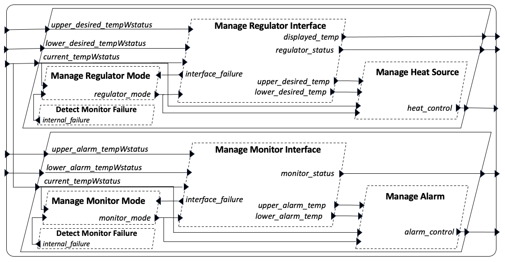
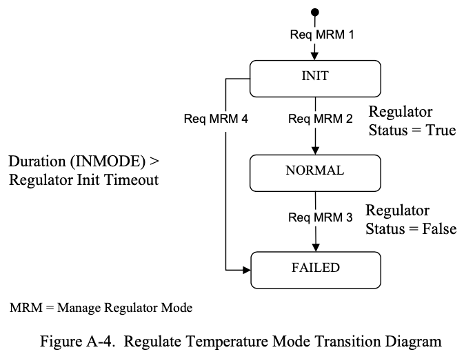

# Identification of System Inputs / Outputs

 ## Inputs to Control in System Testing

 * Current Temperature (w status)

 * Upper Desired Temperature (w status)
 * Lower Desired Temperature (w status)
 * Regulator Internal Failure

 * Upper Alarm Temperature (w status)
 * Lower Alarm Temperature (w status)
 * Monitor Internal Failure

## Outputs to Monitor in System Testing

 * Heat Control
 * Display Temperature
 * Regulator Status

 * Alarm Control
 * Monitor Status

# Temporal Architecture

* Discuss transition from AADL init to compute phase
* Discuss sensing / actuation temporal points
* Discuss mode transition temporal points

# Initialization Properties

Given as an example:

* Outputs for Manage Heat Source are appropriately initialized

Zhaoxiang to do: 

* Outputs for Manage Regulator Interface are appropriately initialized

* Outputs for Manage Regulator Mode are appropriately initialized

# Compute Phase Properties

## Output: Heat Control

### Normal Mode Properties

* [**Done** - Heat control on] When the mode is normal,
  if the current temperature is less than the lower desired temperature,
  then the heat control shall be on.

* [**Done** - Heat control off] When the mode is normal,
  if the current temperature is greater than the upper desired temperature,
  then the heat control shall be off.

* [Heat control unchanged] When the mode is normal,
  if the current temperature is greater than or equal to the lower desired temperature,
  and the current temperature is less than or equal to the lower desired temperature,
  then the heater state is unchanged.

### Init Mode Properties

### Failed Mode Properties

## Output: Display Temperature

### Normal Mode Properties

* In Normal Mode, output for Display Temperature is "correct" (test for output of the MRI component, later on, test for the appropriate value at the operator interface)

### Init Mode Properties

### Failed Mode Properties

## Output: Regulator Status

### Normal Mode Properties

* In Normal Mode, output for Regulator Status is correct (test for output of the MRI component, later on, test at the appropriate value at the operator interface)

### Init Mode Properties

### Failed Mode Properties

# Regulator Mode Transition

## Init Mode to Normal Mode

(need tests for all causes of transitioning from init mode to normal mode)

## Normal Mode to Failed Mode

(need tests for all causes of transitioning from normal mode to failed mode)

* [Mode Transition - Normal to Failed] When a regulator internal failure is detected, then mode transitions to FAILED

## Init Mode to Failed Mode

(need tests for all causes of transitioning from init mode to failed mode)

## Failed Mode Persistence

(need tests to show that if system is in failed mode, it will continue to be in failed mode)

# Consider how the following should be accounted for

Consequences of Failure Mode Triggered

* [Heat control is off in FAILED state] When the subsystem mode is FAILED,
  then heater state is OFF.

* [**Done** - Invalid temperature inputs leads to heat control off:] 
   - If the lower desired temperature status has an invalid status, then the heat control will be off
   - If the upper desired temperature status has an invalid status, then the heat control will be off
   - If the current temperature status has an invalid status, then the heat control will be off

* [Invalid temperature inputs leads to FAILED mode:] 
   - If the lower desired temperature status has an invalid status, then the heat control will be off
   - If the upper desired temperature status has an invalid status, then the heat control will be off
   - If the current temperature status has an invalid status, then the heat control will be off

# Notions of coverage

* Port coverage (ports read, ports written)
* Connection coverage
* Value coverage on ports  (with special emphasis on input/output ports)
* Coverage of contract clauses (roughly corresponds to coverage of requirements, since contracts are derived from requirements)
* Code coverage
* Coverage of different types of AADL run-time 
  - coverage of buffer overflow (e.g., no buffer overflows occur)
  - coverage of dispatch conditions (e.g., for sporadic, component is triggered by each one of its dispatch triggers)
* Schedule step coverage (how many total hyperperiodics has the schedule run through, what is the longest trace)  
* (Chris) Table cell coverage

## To Discuss with Jason

* Stop() command - Jason mentioned that we should discuss this.  Do we need this? Should we try to modify the implementation so that it is not required?

* Observation theory [More of a John issue]: clarify the nature of observations that we are making.  Are we observing application port states or infrastructure port states?

* Do we have the capability to read the values of input ports in the post state?

* Consider the ability to test port input values after the communication dimension has been run after the initialization phase

* Deal with the timeout in Manage Regular Mode by moving to failure mode after a certain number of activitations of the MRM thread.   This is sufficient (don't need to 
have a notion of timer) because the thread is periodic and so we can calculate the time based on the number of activations.

* I believe we need to design some architecture for I/O devices, aligned with Jason's stuff, that allows system tests to set values coming from the environment (e.g., set the current temperature) and read values going to the environment (e.g., heat control)
 

