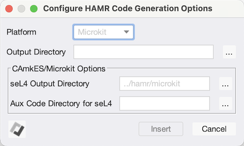

# Rust/Verus

## Installation

1. Install Sireum and CodeIVE (ie. VS Codium + extensions) by following the SysMLv2-Models [toolchain installation instructions](https://github.com/santoslab/sysmlv2-models?tab=readme-ov-file#toolchain-installation).

1. Set the ``SIREUM_HOME`` environment variable to point to the location where you installed Sireum.  For e.g. on Linux/Mac

    ``` bash
    export SIREUM_HOME=<path-to-sireum>
    export PATH=$SIREUM_HOME/bin:$PATH
    ```

    Running ``sireum`` from the command line should show Sireum's build date and command line options.

1. Install Rust 1.82.0

    Verus requires Rust 1.82.0 which can be installed via

    ```
    $SIREUM_HOME/bin/install/rust.cmd 1.82.0
    ```

1. Install Verus and Verus-Analyzer

    Download the latest Verus release from https://github.com/verus-lang/verus/releases

    Verus-Analyzer is not available via VS Codium's extension store but can be installed by downloading the appropriate vsix file from https://github.com/verus-lang/verus-analyzer/releases and then follow the [Install from a VSIX](https://code.visualstudio.com/docs/configure/extensions/extension-marketplace#_install-from-a-vsix) instructions.  For e.g. on a Mac

    ```bash
    $SIREUM_HOME/bin/mac/vscodium/CodeIVE.app/Contents/Resources/app/bin/codium --install-extension verus-analyzer-darwin-arm64.vsix
    ```

1. Clone this repo and cd into it

   ```
   git clone https://github.com/loonwerks/INSPECTA-models.git
   cd INSPECTA-models
   ```

1. Clone the [SysMLv2 AADL Libraries](https://github.com/santoslab/sysml-aadl-libraries.git) into the Isolette's [sysml](sysml) directory

    ```
    git clone https://github.com/santoslab/sysml-aadl-libraries.git isolette/sysml/sysml-aadl-libraries
    ```

## Running Codegen from CodeIVE

1. Open the Isolette's [SysMLV2 directory](./sysml/) in CodeIVE so that it's the root of a Workspace.  E.g. ``File`` >> ``Open Folder`` or from the command line on Mac

    ```
    $SIREUM_HOME/bin/mac/vscodium/CodeIVE.app/Contents/Resources/app/bin/codium <inspecta-repo-path>/isolette/sysml/
    ```

1. Open [Isolette.sysml](./sysml/Isolette.sysml) and specify code generation options.

    A file option at the top of the file has already been added that will regenerate Microkit code to the [hamr/microkit](./hamr/microkit/) directory. You can manually edit that entry or use the option form to edit or insert entries.  That can be launched by opening the Command Palette and typing ``HAMR SysML Codegen Configurator``

    
    
1. Run codegen

    Open the Command Pallette and type ``HAMR SysML Codegen``.  Select ``Microkit`` from the list of target platforms.

1. Open the Manage Heat Source (MHS) Rust crate in Codium.

    Threads that should be implemented in Rust are specified using the ``HAMR::Microkit_Language`` property (e.g. for the [MHS](./sysml/Regulate.sysml#L441)).

    Add the MHS crate as a Workspace.  Go to ``File`` >> ``Open Folder as Workspace`` and choose [hamr/microkit/crates/thermostat_rt_mhs_mhs/](./hamr/microkit/crates/thermostat_rt_mhs_mhs/).

    Open the [MHS app](./hamr/microkit/crates/thermostat_rt_mhs_mhs/src/component/thermostat_rt_mhs_mhs_app.rs) whose API and Verus contracts were generated from the [MHS SysMLv2 Thread](./sysml/Regulate.sysml#L437-L517).

1. Verify MHS behavior code using Verus

    Seed the bug at [line 144](./hamr/microkit/crates/thermostat_rt_mhs_mhs/src/component/thermostat_rt_mhs_mhs_app.rs#L144).  Saving the file will trigger Verus which should report that it was not able to discharge REQ-MHS-2.

    

    Alternatively you can run ``make verus`` from the command line

1. Run GUMBOX-based MHS Unit Tests

    Open [tests.rs](./hamr/microkit/crates/thermostat_rt_mhs_mhs/src/tests.rs) and choose ``Run Tests``.  Alternatively you can run ``make test`` from the command line.  These use the GUMBOX generated executable contracts in [thermostat_rt_mhs_mhs_GUMBOX](./hamr/microkit/crates/thermostat_rt_mhs_mhs/src/bridge/thermostat_rt_mhs_mhs_GUMBOX.rs).

## Running the Microkit system

Follow the instructions in the top-level [readme](./readme.md)