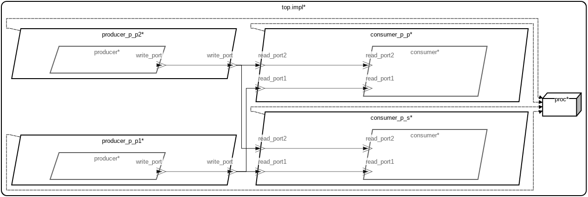

# AADL Event Data Ports

 Table of Contents
  * [Diagrams](#diagrams)
    * [AADL Arch](#aadl-arch)
  * [Metrics](#metrics)
    * [AADL Metrics](#aadl-metrics)

## Diagrams
### AADL Arch


## Metrics
### AADL Metrics
| | |
|--|--|
|Threads|4|
|Ports|6|
|Connections|4|


## Codegen

1. Install [Docker Desktop](https://www.docker.com/products/docker-desktop/)

1. Clone this repo and cd into it ``INSPECTA-models``

   ```
   git clone https://github.com/loonwerks/INSPECTA-models.git
   cd INSPECTA-models
   ```

1. *OPTIONAL*

    If you want to rerun codegen then you will need to install Sireum
    and OSATE.  You can do this inside or outside of the container that you'll install in the next step (the latter is probably preferable as you could then use Sireum outside of the container).

    Copy/paste the following to install Sireum
    ```
    git clone https://github.com/sireum/kekinian.git
    kekinian/bin/build.cmd
    ```

    This installs/build Sireum from source rather than via a binary distribution (which is probably the prefered method for PROVERS).  

    Now set ``SIREUM_HOME`` to point to where you cloned kekinian and add ``$SIREUM_HOME/bin`` to your path.  E.g. for bash

    ```
    echo "export SIREUM_HOME=$(pwd)/kekinian" >> $HOME/.bashrc
    echo "export PATH=\$SIREUM_HOME/bin:\$PATH" >> $HOME/.bashrc
    source $HOME/.bashrc
    ```

    To update Sireum in the future do the following
    ```
    cd $SIREUM_HOME
    git pull --rec
    bin/build.cmd
    ```


    Now install OSATE and the Sireum OSATE plugins into your current directory (or wherever as indicated via the ``-o`` option).  For Windows/Linux 

    ```
    sireum hamr phantom -u -v -o $(pwd)/osate
    ```

    or for Mac copy/paste
    ```
    sireum hamr phantom -u -v -o $(pwd)/osate.app
    ```

    Now set ``OSATE_HOME`` to point to where you installed Osate

    ```
    echo "export OSATE_HOME=$(pwd)/osate" >> $HOME/.bashrc
    source $HOME/.bashrc
    ```

1. Download and run the CAmkES docker container, mounting the ``INSPECTA-models`` directory into it

   ```
   docker run -it -w /root -v $(pwd):/root/INSPECTA-models jasonbelt/microkit_domain_scheduling
   ```

   This container includes customized versions of Microkit and seL4 that support domain scheduling.  They were built off the following pull requests

   - [microkit #175](https://github.com/seL4/microkit/pull/175)
   - [seL4 #1308](https://github.com/seL4/seL4/pull/1308)

1. *OPTIONAL* Rerun codegen
   
    Launch the Slash script [micro-examples/microkit/aadl_port_types/event_data/base_type/aadl/bin/run-hamr.cmd](aadl/bin/run-hamr.cmd) from the command line.  

   ```
   micro-examples/microkit/aadl_port_types/event_data/base_type/aadl/bin/run-hamr.cmd
   ```

1. Build and simulate the image

    Inside the container do the following

    ```
    export MICROKIT_BOARD=qemu_virt_aarch64
    export MICROKIT_SDK=/root/microkit/release/microkit-sdk-1.4.1-dev.14+cf88629
    cd $HOME/INSPECTA-models/micro-examples/microkit/aadl_port_types/event_data/base_type/hamr/microkit
    make qemu
    ```

    Type ``CTRL-a x`` to exit the QEMU simulation

    The producers are populating [this](aadl/event_data_2_prod_2_cons.aadl#L15) datatype via [this](hamr/microkit/components/producer_p_p1_producer/src/producer_p_p1_producer_user.c#L9-L19) and [this](hamr/microkit/components/producer_p_p2_producer/src/producer_p_p2_producer_user.c#L9-L18) implementation to the consumers so you should get output similar to

    ```
    Booting all finished, dropped to user space
    MON|INFO: Microkit Bootstrap
    MON|INFO: bootinfo untyped list matches expected list
    MON|INFO: Number of bootstrap invocations: 0x00000009
    MON|INFO: Number of system invocations:    0x000000fe
    MON|INFO: completed bootstrap invocations
    MON|INFO: completed system invocations
    consumer_p_p_con: I'm periodic
    consumer_p_s_con: I'm sporadic
    producer_p_p1_pr: I'm periodic
    producer_p_p2_pr: I'm periodic
    consumer_p_p_con: nothing received on read port 1
    consumer_p_p_con: nothing received on read port 2
    -------
    producer_p_p1_pr: sent event 0
    producer_p_p2_pr: sent event 0
    consumer_p_p_con: received 0 on read port 1 event
    consumer_p_p_con: received 0 on read port 2 event
    consumer_p_s_con: Received 0 on read port 1
    consumer_p_s_con: Received 0 on read port 2
    -------
    producer_p_p1_pr: no send
    producer_p_p2_pr: no send
    consumer_p_p_con: nothing received on read port 1
    consumer_p_p_con: nothing received on read port 2
    -------
    producer_p_p1_pr: sent event 2
    producer_p_p2_pr: no send
    consumer_p_p_con: received 2 on read port 1 event
    consumer_p_p_con: nothing received on read port 2
    consumer_p_s_con: Received 2 on read port 1
    -------
    producer_p_p1_pr: no send
    producer_p_p2_pr: sent event 3
    consumer_p_p_con: nothing received on read port 1
    consumer_p_p_con: received 3 on read port 2 event
    consumer_p_s_con: Received 3 on read port 2
    -------
    producer_p_p1_pr: sent event 4
    producer_p_p2_pr: no send
    consumer_p_p_con: received 4 on read port 1 event
    consumer_p_p_con: nothing received on read port 2
    consumer_p_s_con: Received 4 on read port 1
    -------
    producer_p_p1_pr: no send
    producer_p_p2_pr: no send
    consumer_p_p_con: nothing received on read port 1
    consumer_p_p_con: nothing received on read port 2
    -------
    producer_p_p1_pr: sent event 6
    producer_p_p2_pr: sent event 6
    consumer_p_p_con: received 6 on read port 1 event
    consumer_p_p_con: received 6 on read port 2 event
    consumer_p_s_con: Received 6 on read port 1
    consumer_p_s_con: Received 6 on read port 2
    -------
    producer_p_p1_pr: no send
    producer_p_p2_pr: no send
    consumer_p_p_con: nothing received on read port 1
    consumer_p_p_con: nothing received on read port 2
    ```